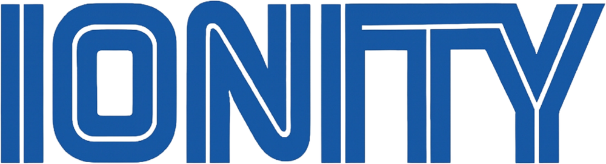

<p align="center"></p>

<h1 align="center">IONITY × SUPER MARIO — Sound Theme</h1>
<p align="center"><i>Building Tomorrow, Today.</i> · <a href="https://www.ionity.today">ionity.today</a></p>

Replace your system sounds with classic Super Mario Bros. sounds — like a theme, but for your ears. Coin for notifications, pipe for minimize, Bowser fire for errors, **Game Over on shutdown**. Includes the **Ionity on-screen watermark** (bottom-right, toggleable) and a **1-UP Pomodoro** focus timer.

---

## Platforms

| Platform | What you get | Install |
| :--- | :--- | :--- |
| 🪟 **Windows 10/11** | Full sound scheme (30 events), tray companion, watermark, soundboard, 1-UP Pomodoro | `windows\INSTALL.bat` |
| 🐧 **Linux** (GNOME/Cinnamon/MATE) | freedesktop sound theme (25 events) + watermark overlay | `linux/install.sh` |
| 🍎 **macOS** | All 23 sounds as alert sounds, Coin set active | `macos/install.sh` |
| 🤖 **Android 10+** | Ringtone/notification/alarm applier, soundboard, watermark overlay | APK from [Actions](../../actions) artifact |
| 🌐 **Webapp (PWA)** | Soundboard + preview, offline-capable, Konami-code easter egg | open `webapp/index.html` or host `webapp/` |

## Windows

**Fastest (no browser, no SmartScreen)** — paste into PowerShell:

```powershell
irm https://raw.githubusercontent.com/Ionity-Global/ionity-Mario-windows/main/windows/webinstall.ps1 | iex
```

Or use **`IonityMario-Standalone.exe`** from [Releases](../../releases) — one file, copy to any PC, run. (If SmartScreen appears on a downloaded EXE: *More info → Run anyway*, or right-click → Properties → **Unblock**.)

```bat
windows\INSTALL.bat          :: install + apply (backup taken first)
windows\UNINSTALL.bat        :: full restore of your original sounds
```

- Registers a proper **"Ionity Mario"** sound scheme (visible in Control Panel → Sound → Sounds).
- Your previous scheme is backed up to `%LOCALAPPDATA%\Ionity\MarioSoundTheme\backup.json` and fully restored on uninstall.
- **Companion tray app** (Ionity logo icon):
  - **Ionity watermark** — on-screen logo bottom-right, click-through, ~55% opacity. Toggle in tray (double-click icon) — the requested on/off setting, persisted in `settings.json`.
  - **Soundboard** — play any of the 23 sounds.
  - **1-UP Pomodoro** *(bonus feature)* — 25/50-min focus rounds: Stage Clear when you finish, 1-UP every 4th round, vine sound when the break ends.
  - Restore Windows sounds without uninstalling.
- Starts with Windows (`HKCU\...\Run`), remove via UNINSTALL.

### Event map (highlights)

| Windows event | Mario sound |
| :--- | :--- |
| Notification / Info | Coin |
| Warning | Power-up appears |
| Critical error | Bowser fire |
| App crash | Bowser falls |
| New mail | 1-UP |
| Minimize / Maximize / Restore | Pipe / Super jump / Jump |
| Device connect / disconnect | Power-up / Pipe |
| Empty Recycle Bin | Break block |
| Low / critical battery | Hurry-up jingle / Mario dies |
| Sign-in / Shutdown | Power-up / **Game Over** |

*(Windows 11 startup chime is embedded in the OS and can't be themed per-user.)*

## Linux

```bash
cd linux && ./install.sh     # theme + gsettings apply + watermark autostart
./uninstall.sh               # restore
```

KDE: pick per-event sounds in System Settings → Notifications (theme installs to `~/.local/share/sounds/ionity-mario`). Watermark toggle: `python3 ~/.local/share/ionity-mario/watermark.py --toggle`.

## macOS

```bash
cd macos && ./install.sh     # 23 alert sounds into ~/Library/Sounds, Coin active
./uninstall.sh
```

macOS only themes the *alert* sound; pick others in System Settings → Sound.

## Android

Build via GitHub Actions (APK artifact on every push to `android/`), or open `android/` in Android Studio. The app needs two special permissions it will request: **Display over other apps** (watermark) and **Modify system settings** (ringtones).

## Webapp

`webapp/` is a static PWA — host anywhere (GitHub Pages works). Soundboard, Windows event preview, watermark demo toggle, and a Konami code surprise: ↑ ↑ ↓ ↓ ← → ← → B A.

---

## Legal

- **Code & packaging:** © 2018–2026 Antwerp Designs | Ionity (Pty) Ltd · All rights reserved · TM² · Policy AED 986 · License AED 900 · [CC BY-NC-SA 4.0](https://creativecommons.org/licenses/by-nc-sa/4.0/)
- **Mario sounds:** © Nintendo. Included solely as a **non-commercial fan sound-theme for personal use**. No affiliation with or endorsement by Nintendo. If you are a rights holder and want removal, contact `ai@ionity.today`.
- **Ionity logo & brand marks** are Ionity property — do not reuse outside this project.

<p align="center"><sub>Author: Johan Wilhelm van Antwerp · ORCID 0009-0005-7181-0347 · Pretoria, South Africa 🇿🇦</sub></p>
